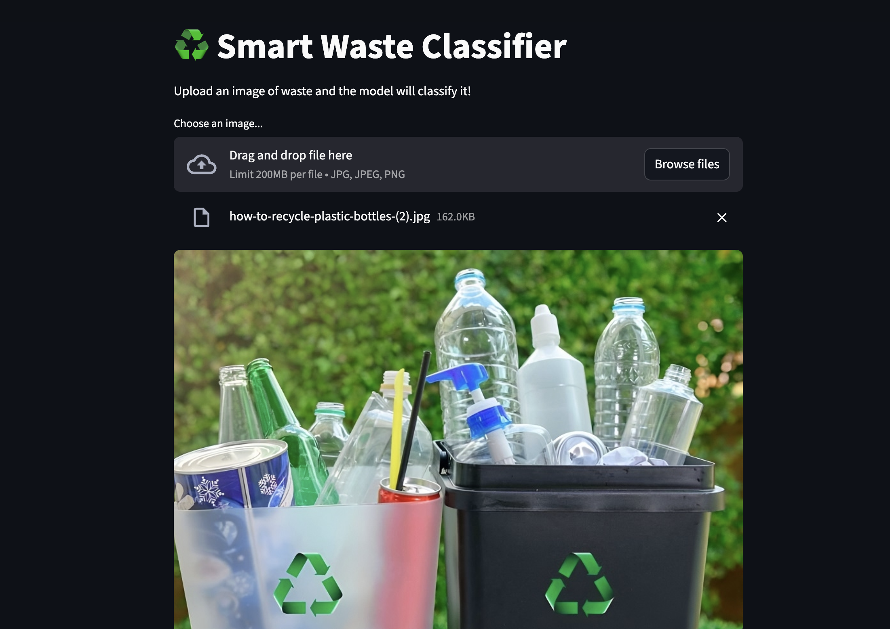
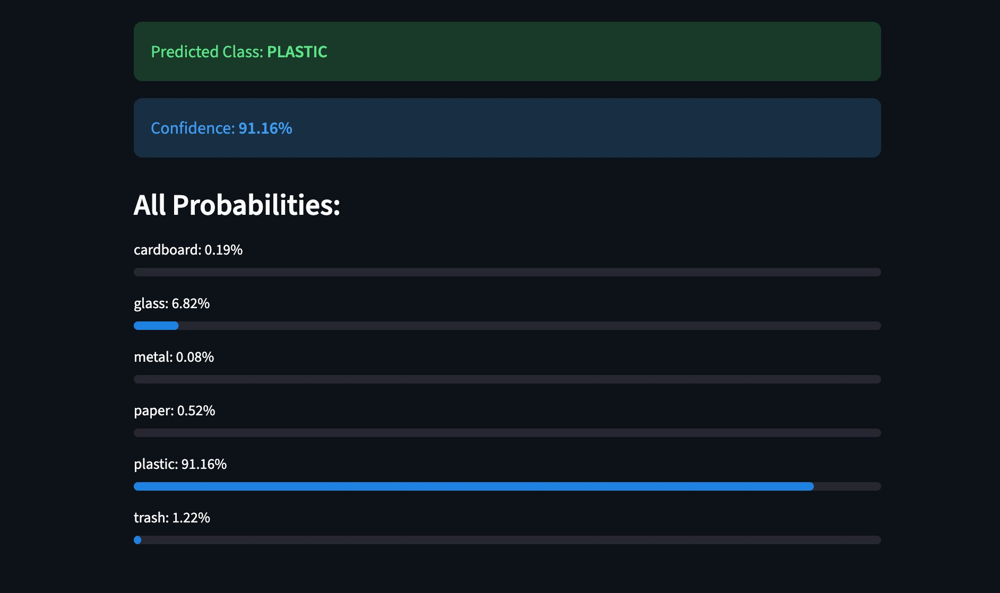

# Smart Waste Classifier

Improper waste disposal is one of the biggest contributors to environmental pollution — a large part of it happens simply because people don't know which bin an item belongs to. This project tackles that problem with a **deep learning system** that looks at a photo of a waste item and instantly tells you its category.

Built completely **end-to-end** — from raw dataset to a working web app. The model is based on **EfficientNetB0** pretrained on **ImageNet**, fine-tuned on the **TrashNet dataset** using a **two-phase transfer learning** strategy. Predictions are served via a **FastAPI** REST endpoint and a **Streamlit UI** where you can upload any waste image and get an instant classification with confidence scores.

The project also follows **MLOps best practices** — dataset and model versioning with **DVC**, and automated **CI checks** on every push via **GitHub Actions**.

> **87.47% validation accuracy** on ~500 unseen images · **91%+ confidence** on real-world images · Trained on TrashNet (**~2,500 images, 6 classes**) · Stack: **EfficientNetB0, FastAPI, Streamlit, DVC, GitHub Actions**
---

## Screenshots

**Upload interface:**



**Prediction result:**



---

## How it works — full pipeline

```
TrashNet Dataset (Kaggle)
        ↓
  Data Split 80/20
  + Augmentation (flip, rotate, zoom)
        ↓
  EfficientNet Preprocessing
  (scale images to -1 to 1)
        ↓
  EfficientNetB0 (pretrained on ImageNet)
  + Custom Head (Dense → Dropout → Softmax)
        ↓
  Phase 1 — Train head only (base frozen)
        ↓
  Phase 2 — Fine-tune top 20 layers (lr=1e-5)
        ↓
  Trained Model (87.47% val accuracy)
        ↓
  ┌─────────────┬──────────────┬──────────────┐
  │  FastAPI    │  Streamlit   │  GitHub      │
  │  /predict   │  Upload UI   │  Actions CI  │
  └─────────────┴──────────────┴──────────────┘
        ↓
  Waste classified with 91%+ confidence
```

---

## What it does

Upload a photo of a waste item — the model returns the predicted category and confidence score for all 6 classes.

**6 categories:** Cardboard · Glass · Metal · Paper · Plastic · Trash

---

## Dataset

- **Source:** TrashNet (Kaggle)
- **Size:** ~2,500 labeled images
- **Split:** 80% training (~2,024 images) / 20% validation (~503 images)

---

## Model — EfficientNetB0

Why EfficientNetB0 over other models:

| Model | Params | Speed | Accuracy |
|---|---|---|---|
| ResNet50 | 25M | Slow | Good |
| MobileNetV2 | 3.4M | Fast | Moderate |
| **EfficientNetB0** | **5.3M** | **Fast** | **Good ✅** |

EfficientNet uses **compound scaling** — it scales depth, width, and resolution together in a balanced way. This gives better accuracy per parameter compared to just making a model deeper or wider. The core building block is MBConv with a **Squeeze-and-Excitation (SE)** attention mechanism that learns which features matter most in each image.

**Custom classification head:**

```
EfficientNetB0 (pretrained on ImageNet, frozen in Phase 1)
        ↓
GlobalAveragePooling2D   ← compress 7×7×1280 feature map to 1280 vector
        ↓
Dense(256) + ReLU        ← learn waste-specific patterns
        ↓
Dropout(0.3)             ← prevent overfitting
        ↓
Dense(6) + Softmax       ← probability for each of 6 classes
```

---

## Training — Two-Phase Transfer Learning

### Why two phases?

If you unfreeze and fine-tune immediately, the random weights in the new head send noisy gradients through the entire pretrained network — destroying the ImageNet knowledge. This is called **catastrophic forgetting**.

So we train in two phases:

**Phase 1 — Head only (base frozen)**
- Learning rate: `1e-3`
- Only the custom head trains
- Base preserves pretrained ImageNet weights
- Runs for up to 10 epochs

**Phase 2 — Fine-tune top layers**
- Unfreeze top 20 layers of EfficientNetB0
- Learning rate: `1e-5` (100x smaller — avoids destroying pretrained weights)
- Top layers adapt to waste images; bottom layers stay frozen

### Training callbacks

| Callback | What it does |
|---|---|
| EarlyStopping | Stops if val_loss doesn't improve for 3 epochs |
| ModelCheckpoint | Saves best model automatically |
| ReduceLROnPlateau | Reduces learning rate when progress stalls |

### Results

| Metric | Value |
|---|---|
| Training accuracy | ~98% |
| **Validation accuracy** | **87.47%** |
| Best epoch | 7 |

The gap between training and validation accuracy (98% vs 87%) is mild overfitting — expected for a small 2,500 image dataset. Phase 2 fine-tuning didn't improve over Phase 1, so the best Phase 1 weights were restored.

---

## A critical preprocessing detail

EfficientNet expects inputs scaled to **-1 to 1**, not the standard 0 to 1. Using wrong rescaling caused poor accuracy in early runs. The fix:

```python
tf.keras.applications.efficientnet.preprocess_input(image)
```

This is an easy-to-miss bug that has a big impact on accuracy.

---

## MLOps stack

| Tool | Purpose |
|---|---|
| **TensorFlow / Keras** | Model training and inference |
| **DVC** | Version control for dataset and model files |
| **FastAPI** | REST API endpoint for predictions |
| **Streamlit** | Web UI for uploading images and viewing results |
| **GitHub Actions** | CI pipeline — checks run on every push |

---

## Running locally

```bash
git clone https://github.com/UchiaObito004/smart-waste-classifier.git
cd smart-waste-classifier

python3 -m venv venv
source venv/bin/activate
pip install -r requirements.txt
```

**Start the API:**
```bash
uvicorn api:app --reload
```

**Start the UI** (new terminal):
```bash
streamlit run app.py
```

**Test from terminal:**
```bash
curl -X POST "http://localhost:8000/predict" \
  -F "file=@/path/to/image.jpg"
```

**Response:**
```json
{
  "predicted_class": "plastic",
  "confidence": "91.16%",
  "all_probabilities": {
    "cardboard": "0.19%",
    "glass": "6.82%",
    "metal": "0.08%",
    "paper": "0.52%",
    "plastic": "91.16%",
    "trash": "1.22%"
  }
}
```

---

## API endpoints

| Method | Endpoint | Description |
|---|---|---|
| GET | `/` | Health check |
| POST | `/predict` | Classify a waste image |

---

## Project structure

```
smart-waste-classifier/
├── api.py                  ← FastAPI inference endpoint
├── app.py                  ← Streamlit web UI
├── code.ipynb              ← Full training notebook
├── data.dvc                ← DVC pointer to dataset
├── requirements.txt        ← All dependencies
├── streamlit_upload.png    ← UI screenshot
├── streamlit_result.png    ← Result screenshot
├── .dvc/                   ← DVC config
└── .github/
    └── workflows/
        └── ci.yml          ← GitHub Actions CI pipeline
```

---

## What I'd improve with more time

- Deploy to Streamlit Cloud or HuggingFace Spaces so anyone can try it
- Add Docker support for one-command deployment
- Collect more data for the trash category — it's the hardest to classify
- Add a confidence threshold — if the model is below 60% confident, return "unclear" instead of a wrong guess

---

## Author

Bhushan — [GitHub](https://github.com/UchiaObito004)
